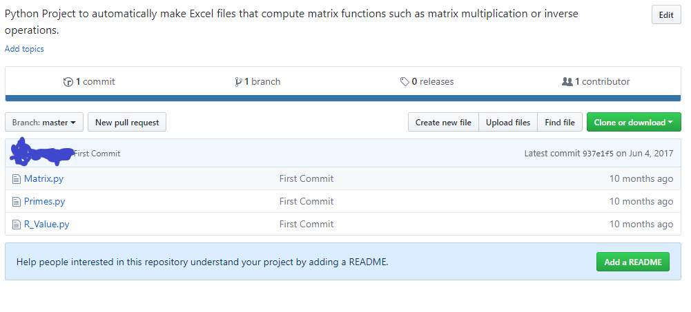
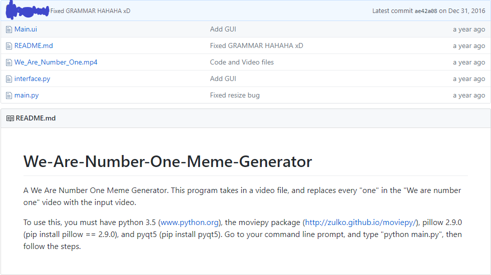
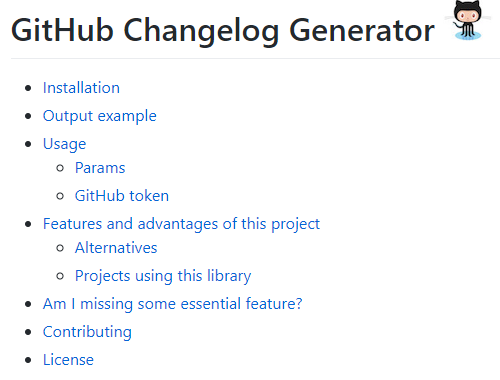
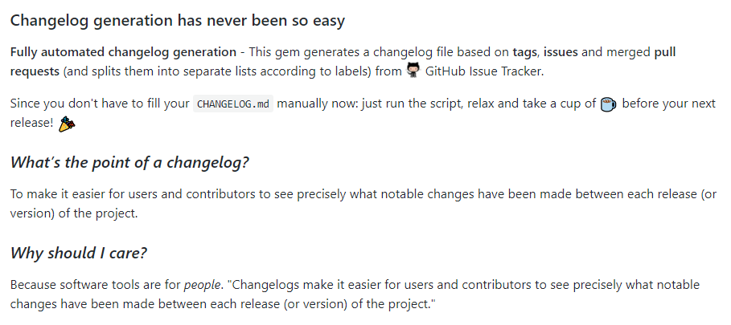
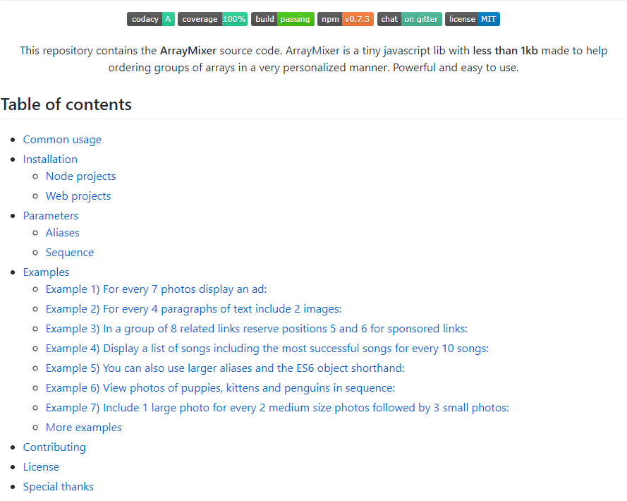
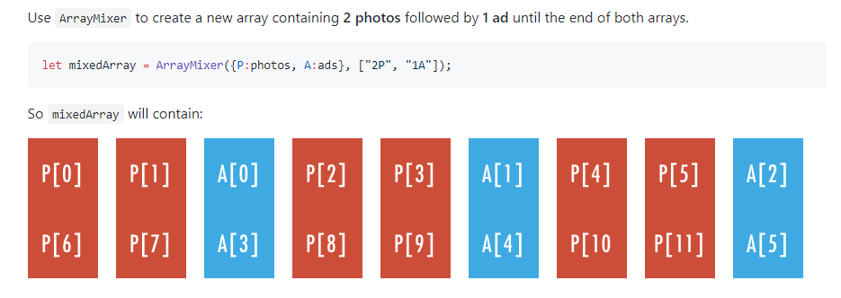
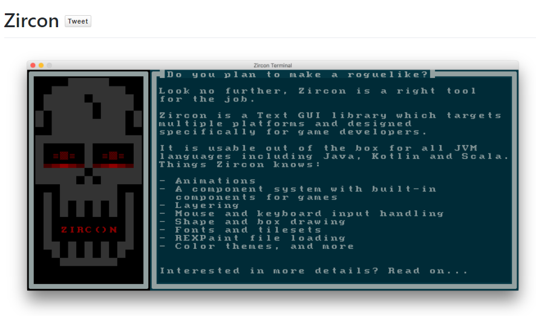
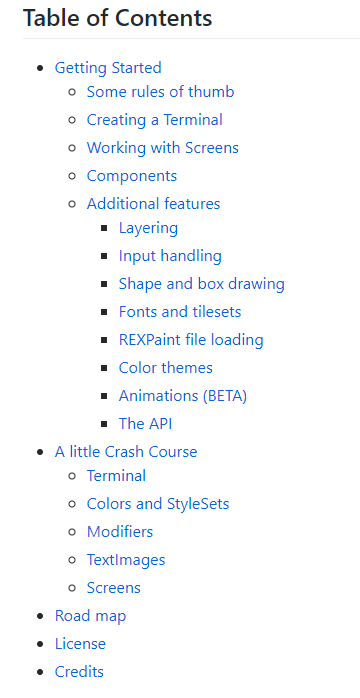
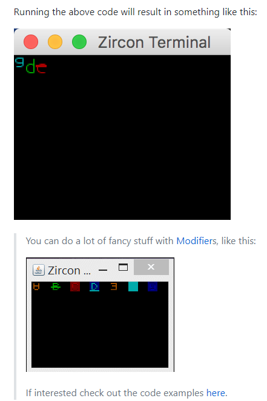

# README Documents

**Introduction**

Github is a site that holds repositories of code using git. Github allows for multiple developers to work on a project at the same time. Anyone can make revisions to an already existing repository, one can create a new repository for a new project, or someone can download the code and use it. Many public repositories are made every single day. With so many repositories, an explanation of what the repository holds is essential to get a project used by other people.

A README document is a file, typically initialized when a repository is made, that describes what the code in a repository does and how to use it. README documents can be very helpful in instructing a user what to do, or they can be almost useless (or non-existent). If a README document is badly written or non-existent, it can be very difficult for someone looking at the repository to figure out what to do. What a good README can do is explain a solution to some problem, and how anyone else can use that solution.

**Bad Examples**

There are plenty of bad examples of README documents available on Github. Both of these examples were taken from the writer’s own Github account to show what not to do when making a README document, nonetheless when maintaining a Github repository.

I. Matrix Repository

*Image 1:Github repository with no README document. Taken from the writer's own Github account.*

The repository in Image 1 gives almost no help to anyone visiting. There’s no README document, so there’s no information to go off of except for the short and unhelpful description at the top of the page. The repository doesn’t say anything about a problem that’s being addressed, potential dependencies, doesn’t show how to run the code, and the filenames itself are unintuitive (what is R_Value.py?).

II. Meme Generator

*Image 2: Github repository with a badly designed README document. Taken from writer’s own Github account.*

This repository gives a better explanation of what it holds with an actual README document, but it can be a lot better. The first paragraph briefly explains what the code does. The second paragraph lists dependencies the project has, but doesn’t explain why they are needed. Two of the dependencies listed have links to other sites, but the others have command line instructions, which can look unfamiliar to some looking at this README (not to mention the inconsistency).

**Good Examples**

I. Github Changelog Generator

*Image 3: Table of Contents in the README document for [skywinder/github-changelog-generator](https://github.com/skywinder/github-changelog-generator).*

*Image 4: Explanation of project in the README document for [skywinder/github-changelog-generator](https://github.com/skywinder/github-changelog-generator).*

This README starts out with a table of contents. This makes it easy for users to click to a specific part in the README. It has sections for explaining how to install the software, how to use it, and some examples made using the software. There is a section that includes what the project is specifically, but it’s not listed in this table. These sections are typically enough for people to know what the project is and how to use it. As a bonus, the README writer included a section for other projects using their code. This allows users to see other people’s implementation of the code which can lead to a better understanding of how the code works.

II. Array Mixer

*Image 5: Table of contents in the README for [teles/array-mixer](https://github.com/teles/array-mixer).*

This README document also starts off with a table of contents, allowing users to go anywhere they need to in the document. The README also explains what the project is (Common usage), installation procedures, and tons of examples. One notable feature of this README document is its sufficient use of images.

*Image 5: Image use in the README document for [teles/array-mixer](https://github.com/teles/array-mixer).*

The use of sample code and images side-by-side in this README document will give a second lens to users learning about this project, allowing them to better understand the usefulness of this code.

III. Zircon

*Image 7: Demo of Zircon in the README document for [Hexworks/zircon.](https://github.com/Hexworks/zircon)*

*Image 8: Table of contents in the README for [Hexworks/zircon](https://github.com/Hexworks/zircon).*

This README doesn’t start off with a table of contents, but instead it starts off with a screenshot of a demo. It lets users see what the project looks like before they know what it is or what it does. The README then goes into the table of contents, listing instructions for installation (Getting Started), explaining what the project is, and tons of examples.

*Image 9: Examples in the README for [Hexworks/zircon](https://github.com/Hexworks/zircon) (The second screen is a gif).*

These examples images/gifs are paired with pieces of code, but they were not included in the screenshot because of their length. The huge number of examples in this README is more than enough for users to start using the code in the repository. 

**Conclusion**

So what makes a good README: a good table of contents, concise explanation of installation and usage, and plenty of examples to work with. Good bonuses for good READMEs can include lists of projects using the code from the README’s repository, images to go alongside code as visual metaphors, and so much more.

**References**

>N. (2017, October 25). Noffle/art-of-readme. Retrieved March 19, 2018, from https://github.com/noffle/art-of-readme

>R. (2018, March 09). RichardLitt/standard-readme. Retrieved March 19, 2018, from https://github.com/RichardLitt/standard-readme

>Choi, K. (2018, February 26). What I learned from an old GitHub project that won 3,000 Stars in a Week. Retrieved March 19, 2018, from https://medium.freecodecamp.org/what-i-learned-from-an-old-github-project-that-won-3-000-stars-in-a-week-628349a5ee14

**Appendix**

>[Github Changelog Generator](https://github.com/skywinder/github-changelog-generator#projects-using-this-library): Repository for automatically making changelogs.
>
>[Array Mixer](https://github.com/teles/array-mixer): Repository for mixing multiple arrays of elements into one array.
>
>[Zircon](https://github.com/Hexworks/zircon): Repository that holds a roguelike game engine.
